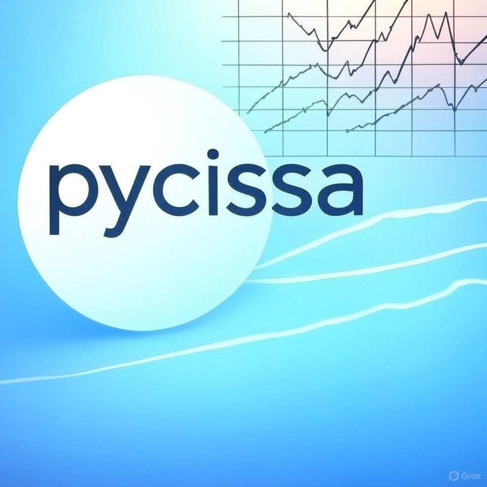

*Image created with Grok from X.ai*

# pycissa: Time Series Analysis with CISSA

`pycissa` is a Python library for performing time series analysis, primarily utilizing **Circulant Singular Spectrum Analysis (CISSA)**.

It is designed to help with tasks such as:
*   Denoising time series data.
*   Detrending series to analyze underlying patterns.
*   Investigating seasonality.

## Installation

Install `pycissa` using pip:
```bash
pip install pycissa
```

## Key Features

*   **Automated Time Series Decomposition:** Leverages CISSA to break down series into trend, periodic components, and noise.
*   **Data Preprocessing:** Includes tools for handling missing data (NaNs) and censored data values.
*   **Significance Testing:** Employs Monte Carlo surrogate methods to assess the statistical significance of identified time series components.
*   **Trend & Seasonality Analysis:** Provides functionalities to extract, analyze, and visualize trends and seasonal patterns.
*   **Analytical Plotting:** Generates various plots to help visualize time series components, spectral properties, and analysis results.

## Automated Functions (`auto_*` methods)

For ease of use, `pycissa` offers several automated functions that perform common analysis tasks with minimal configuration. The primary parameter you'll often specify is `L`, the window length for CISSA.

### `auto_cissa(L, **kwargs)`
*   **Purpose:** Performs a full, automated CISSA procedure, including data cleaning, component decomposition, significance testing, and grouping into trend, periodic, and noise components.
*   **Example:**
    ```python
    # Assuming cissa_object is an initialized Cissa instance
    # window_L = 60 # e.g., for 5 years of monthly data
    # cissa_object.auto_cissa(L=window_L)
    ```
*   **Key Outputs:** Populates `cissa_object.x_trend`, `cissa_object.x_periodic`, `cissa_object.x_noise`, and generates various plots in `cissa_object.figures`. Detailed results are in `cissa_object.results`.

### `auto_denoise(L, **kwargs)`
*   **Purpose:** Automatically denoises the time series by separating the main signal (trend and significant periodicities) from noise.
*   **Example:**
    ```python
    # cissa_object.auto_denoise(L=window_L)
    ```
*   **Key Outputs:** The denoised series is available in `cissa_object.x_denoised`. Also populates `x_trend`, `x_periodic`, and `x_noise`.

### `auto_detrend(L, **kwargs)`
*   **Purpose:** Automatically identifies and removes the trend component from the time series.
*   **Example:**
    ```python
    # cissa_object.auto_detrend(L=window_L)
    ```
*   **Key Outputs:** The extracted trend is in `cissa_object.x_trend`, and the detrended series in `cissa_object.x_detrended`.

### `auto_cissa_classic(I, L, **kwargs)`
*   **Purpose:** Provides an automated CISSA analysis that closely follows the grouping strategy of an original MATLAB CISSA implementation. The `I` parameter is key for defining how components are grouped (e.g., based on data frequency for yearly seasonality, or custom index selections).
*   **Example:**
    ```python
    # Assuming cissa_object and window_L are defined
    # For monthly data, I=12 might be used for yearly cycle grouping
    # cissa_object.auto_cissa_classic(I=12, L=window_L)
    ```
*   **Key Outputs:** Reconstructs components like `cissa_object.x_trend`, `cissa_object.x_seasonality` based on the `I` parameter. Results are also in `cissa_object.results['cissa']['manual']`.

*Note: These functions often call `auto_fix_censoring_nan` internally to handle data cleaning if needed. You can pass further arguments via `**kwargs` to customize their behavior.*

## Examples

To see `pycissa` in action and get a practical understanding of its application, please refer to the Jupyter notebooks located in the `examples/` directory of this repository.

*   **Primary Example:** The `examples/cissa/auto_cissa_examples/Auto-Cissa.ipynb` notebook is an excellent starting point. It demonstrates the use of the main `auto_cissa()` pipeline for a comprehensive analysis.

*   **Other Examples:** You will also find other notebooks in subdirectories like `examples/cissa/auto_cissa_examples/` and `examples/cissa/gap_filling/` that showcase specific features such as automated denoising, detrending using different parameters, and techniques for handling missing data (gap filling).

These examples provide code snippets and visualizations that you can adapt for your own time series analysis tasks.

## Basic Usage Snippet

Here's a quick look at how to import `pycissa` and initialize the main `Cissa` object with your data:

```python
from pycissa import Cissa
import numpy as np # Or pandas for data handling

# Assuming you have your time series data:
# t_data = np.array([...]) # Your time points (e.g., numerical indices or datetime objects)
# x_data = np.array([...]) # Your data values

# Create a Cissa object
# cissa_analyzer = Cissa(t=t_data, x=x_data)

# You can now use methods like cissa_analyzer.auto_cissa(L=your_window_length)
```
Make sure your `t_data` and `x_data` are 1D NumPy arrays or pandas Series.

## References and Further Information

For a deeper understanding of the Circulant Singular Spectrum Analysis (CISSA) methodology, please refer to the primary academic paper:

*   Bógalo, J., Poncela, P., & Senra, E. (2021). "Circulant singular spectrum analysis: a new automated procedure for signal extraction". *Signal Processing, 179*, 107824.
    *   DOI: [https://doi.org/10.1016/j.sigpro.2020.107824](https://doi.org/10.1016/j.sigpro.2020.107824)

The original MATLAB implementation by the paper's authors can be found at:
*   [https://github.com/jbogalo/CiSSA](https://github.com/jbogalo/CiSSA)
